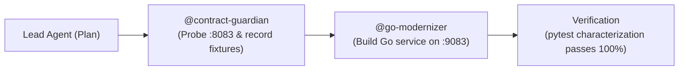

# Clean-Room Service Modernization Playbook

This skill defines the standard operating procedure (SOP) for re-platforming legacy services into modern, high-performance Go microservices while guaranteeing 100% byte-for-byte contract fidelity.

---

## 1. Fast Planning Protocol (Zero-Exploration Planning)

When the lead agent plans a service modernization task:
- Keep the implementation plan concise, high-level, and fast (target < 1 minute).
- **Strict Planning Boundary**: Do **NOT** probe live HTTP endpoints (`curl`, `urllib`, etc.) and do **NOT** inspect backend source code (e.g. `LedgerController.java`, `users/app.py`) during plan creation.
- Formulate the plan solely based on the requirements in the GitHub issue and this playbook.
- All discovery, endpoint probing, and implementation work must be delegated to the designated subagents.

---

## 2. Delegation Sequence & Clean-Room Order

Execution must follow a strict three-phase clean-room workflow:



### Phase 1: Contract Locking (`@contract-guardian`)
- **Assignee**: `@contract-guardian` (Characterization Specialist).
- **Responsibilities**:
  1. Probe the running legacy Python service on default host port `8083` across all endpoints (`/healthz`, `/statements/{id}`, `/statements/{id}/summary`).
  2. Capture live HTTP responses verbatim into immutable golden JSON fixtures in `statements/fixtures/`.
  3. Write automated characterization tests in `statements/tests/` that assert exact response structure and field mapping.
  4. Ensure tests read `STATEMENTS_URL = os.environ.get("STATEMENTS_URL", "http://localhost:8083")`.
  5. Run characterization tests against the live legacy Python service to confirm 100% pass before implementation begins.
- **Boundary**: `@contract-guardian` cannot write or modify Go code.

### Phase 2: Go Implementation (`@go-modernizer`)
- **Assignee**: `@go-modernizer` (Go Systems Engineer).
- **Responsibilities**:
  1. Implement the Go microservice strictly inside `statements/` adhering to the specifications and golden fixtures.
  2. Create a lightweight multi-stage Dockerfile (Go builder + minimal alpine runtime with `curl` for health checks).
  3. Publish the modernization worktree container on offset port `9083` (using `STATEMENTS_PORT=9083`).
  4. Rebuild the service: `docker compose up -d --build statements`.
  5. Run the characterization test suite against the Go service:
     ```bash
     STATEMENTS_URL=http://localhost:9083 pytest statements/tests/
     ```
  6. Confirm all characterization tests pass green without modifying fixtures.
- **Boundary**: `@go-modernizer` is strictly forbidden from altering test fixtures or assertions.

### Phase 3: Fast Verification & Definition of Done
- **Acceptance Criteria**: The characterization test suite passing 100% green against `STATEMENTS_URL=http://localhost:9083` is the definitive acceptance criteria.
- **Strict Scope Boundaries**:
  - Once `@go-modernizer` passes the characterization tests, conclude Phase 3 immediately and report completion.
  - Do **NOT** run test suites or commands for other services (do **NOT** run `pytest users/tests/`, `pytest fraud/tests/`, or Maven ledger tests). Verification of other services is handled during the release finale on `main`.
  - Do **NOT** re-record, modify, or commit refreshed golden fixtures; the original fixtures recorded by `@contract-guardian` must remain immutable.
- **Quick Endpoint Check**: The lead agent verifies service health via `curl -fsS http://localhost:9083/healthz` and confirms `/statements/1` returns JSON.
- **Skip Browser Agent**: Do NOT launch Chrome DevTools MCP or the browser agent in this worktree. Rely strictly on the automated characterization tests for faster, deterministic execution (full browser verification is performed during the finale).

---

## 3. Worktree Environment & Port Conventions

In parallel worktree environments, the stack runs with offset host ports to prevent collisions with the primary stack on port 8080:

| Service | Primary Host Port | Worktree Host Port | Container Internal Port |
| :--- | :--- | :--- | :--- |
| **frontend** | `8080` | `9080` | `8080` |
| **users** | `8081` | `9081` | `8081` |
| **ledger** | `8082` | `9082` | `8082` |
| **statements** | `8083` | `9083` | `8083` |

- `docker-compose.yml` automatically mounts the pre-seeded SQLite volumes (`gemini-bank_ledger-data` and `gemini-bank_users-data`) across worktrees, ensuring data parity between legacy fixtures and modernized assertions.
